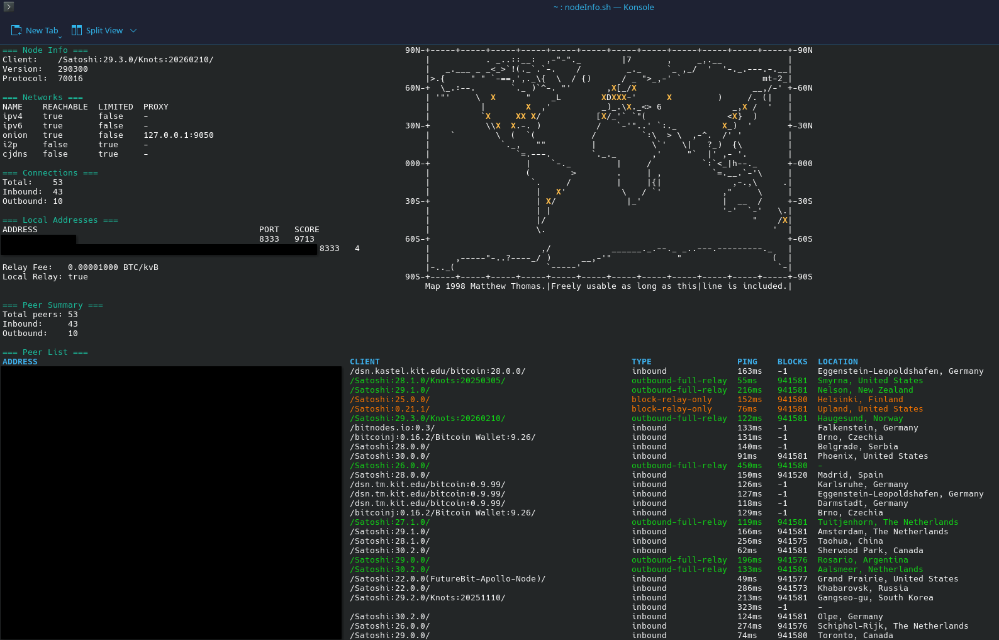

# nodeInfo.sh

A terminal dashboard for monitoring a Bitcoin node's network status, peer connections, and geographic peer distribution — displayed in a color-coded, interactive layout with an ASCII world map.

## Screenshot



## Features

- **Node info panel** — client version, protocol version, active networks, connection counts, and local addresses
- **ASCII world map** — peer locations plotted by geolocation in real time
- **Peer summary** — total, inbound, and outbound connection counts
- **Color-coded peer list** — peers color-coded by connection type with location data
- **Interactive pager** — full output rendered through `less` with ANSI color support

## Requirements

| Dependency | Purpose |
|---|---|
| `zsh` | Shell interpreter |
| `curl` | RPC calls and geo lookup |
| `jq` | JSON parsing |
| `python3` | Map rendering and layout |
| `column` | Peer list table formatting |
| `less` | Interactive output pager |
| `qdbus6` / `wmctrl` / `xdotool` | Auto-maximize window (optional) |

The script also calls the free [ip-api.com](http://ip-api.com) batch endpoint to geolocate peer IPs. No API key is required.

## Configuration

The script reads credentials and node address from a `config.json` file in the **same directory** as the script:

```json
{
  "user": "your_rpc_username",
  "pass": "your_rpc_password",
  "node": "127.0.0.1:8332"
}
```

## Usage

```bash
chmod +x nodeInfo.sh
./nodeInfo.sh
```

The script can also be launched from a desktop shortcut. On KDE Wayland it will attempt to maximize the terminal window automatically; on X11 sessions it falls back to `wmctrl` or `xdotool`.

## Output Layout

```
=== Node Info ===          [ASCII World Map with peer locations marked as X]
Client:    /Satoshi:...
Version:   ...
...

=== Peer Summary ===
Total peers: N
Inbound:     N
Outbound:    N

=== Peer List ===
ADDRESS   CLIENT   TYPE                PING   BLOCKS   LOCATION
...
```

### Peer color coding

| Color | Connection type |
|---|---|
| Green | `outbound-full-relay` |
| Yellow | `block-relay` |
| Dim/gray | `inbound` |
| Red | Other / unknown |

## Notes

- The geo lookup batches all peer IPs in a single POST request to `ip-api.com/batch`. Private/reserved IPs (Tor, I2P, etc.) will return no location and are omitted from the map.

- The map is based on a 1998 ASCII art world map by Matthew Thomas and is freely usable as long as the attribution line is preserved.
- The script fetches network info first and renders an initial view before geo lookups complete, then re-renders the full layout once peer locations are available.
